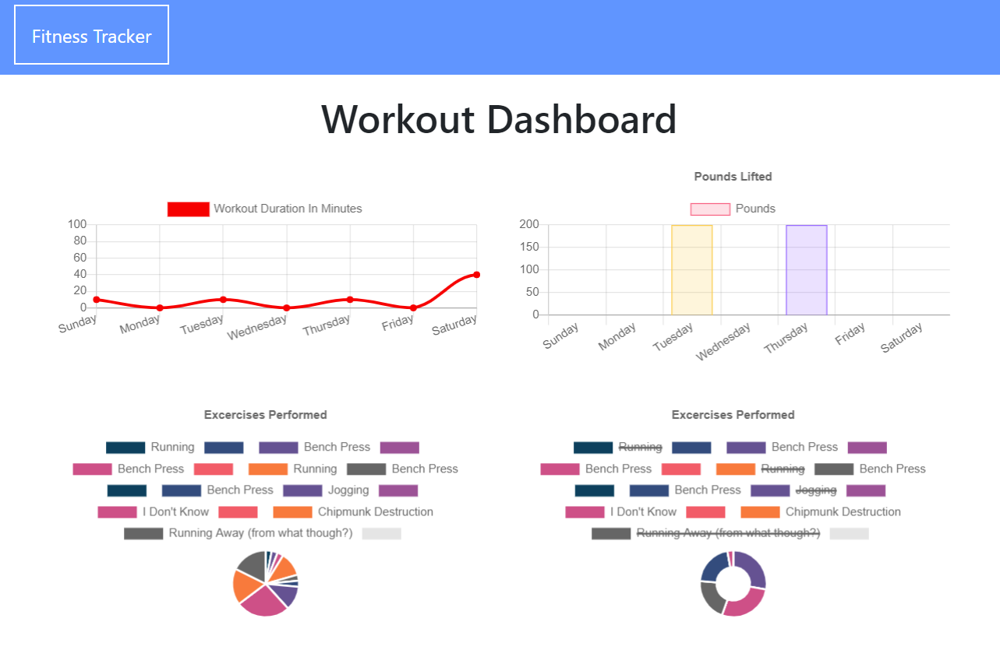

# Personal Trainer 
[](https://choosealicense.com/licenses/gpl-3.0/)



#### Deployed Application: [Check it out on Heroku](https://lets-workout.herokuapp.com/)
    
## Description
**Personal Trainer** is a web application that that helps consumers reach their fitness goals by tracking their workout progress. Exercises are shown in two line graphs and two pie charts with each exercise shown below, all divided into two categories "All Exercises" and "Pounds Lifted".

---

#### Table of Contents
- [Deployed Application](#deployed-application)
- [Description](#description)
- [User Story](#user-story)
- [Demo](#demo)
- [Technologies Used](#technologies-used)
- [Contributing](#contributing)
- [License](#license)
- [Questions](#questions)

---

### User Story
```
As a user, I want to be able to view create and track daily workouts. I want to be able to log multiple exercises in a workout on a given day. I should also be able to track the name, type, weight, sets, reps, and duration of exercise. If the exercise is a cardio exercise, I should be able to track my distance traveled.
```

### Demo 


*[Try it out for yourself!](https://lets-workout.herokuapp.com/)*

### Technologies Used
- MongoDB
- MongoDB Atlas
- Express
- Mongoose
- Dotenv
- Nodemon

### Contributing
If you'd like to contribute to this application, feel free to submit a pull request.

#### License
This project is licensed under GPL v3.0. 

#### Questions
    
If you have any questions, please [email me.](mailto:aiden.threadgoode@gmail.com)

If you'd like to see more of my work, feel free to check out [my github!](https://github.com/a-thread)

*© 2020 Aiden Threadgoode*
    